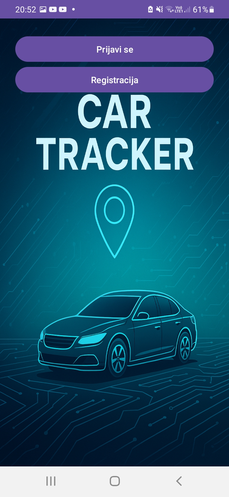
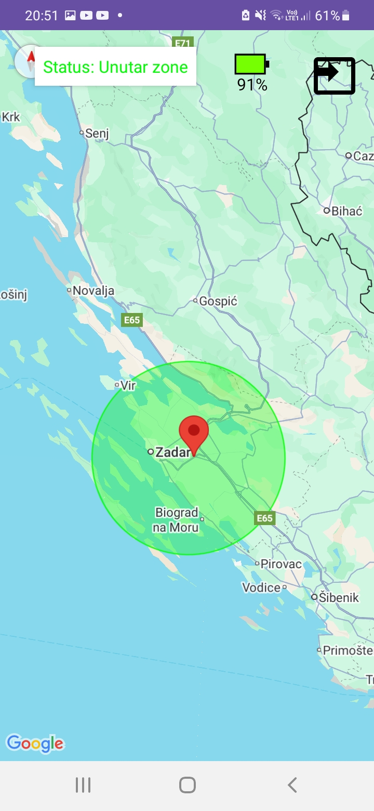
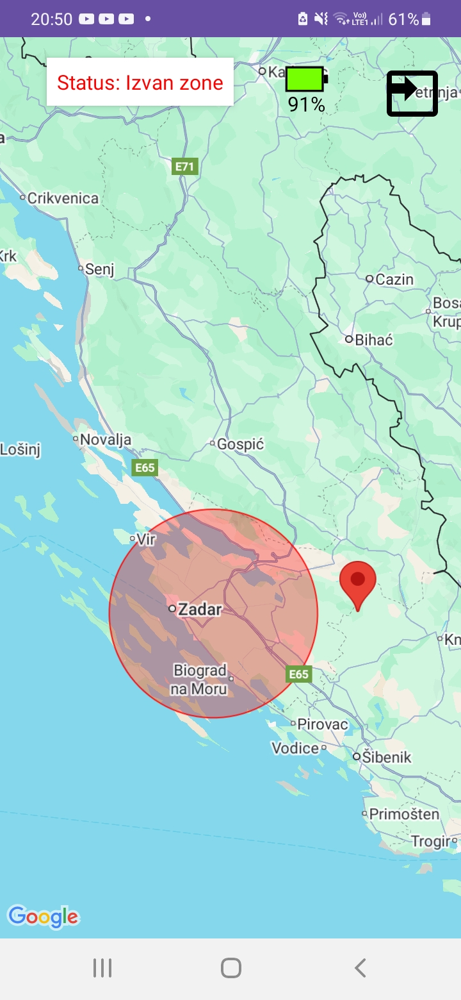

# CarTracker

**CarTracker** is an end‑to‑end, privacy‑preserving vehicle tracking system composed of:

- [**CarTracker Android app**](android) (Kotlin) — displays real‑time vehicle location from Firebase on Google Maps.
- [**Embedded firmware**](firmware/stm32f429_sim7600_rawtcp) (STM32F429 + SIM7600G‑H) — acquires GNSS position and streams compact JSON over raw TCP.
- [**Python TCP relay (Oracle VM)**](server/python) — receives JSON over TCP and updates Firebase Realtime Database via HTTPS.

## System Architecture
```mermaid
flowchart LR
    Device[STM32F429 + SIM7600G-H]
    Relay[Python TCP Relay\n(Oracle VM)]
    Firebase[Firebase Realtime DB]
    App[Android App\n(Kotlin)]

    Device -- TCP / JSON --> Relay
    Relay -- HTTPS --> Firebase
    Firebase -- Realtime Sync --> App
```

## Getting Started

### 1. Clone the repository
```bash
git clone https://github.com/ivan-marusic/CarTracker.git
```
---

## Features

- **Live location** updates to Firebase Realtime Database
- **Lightweight modem stack**: SIM7600 AT‑sockets (`NETOPEN`/`CIPOPEN`/`CIPSEND`) — **no PPP/LwIP** on the MCU
- **Minimal bandwidth JSON**: `{"latitude":..., "longitude":..., "timestamp":"..."}` (newline‑delimited)
- **Clean separation of concerns**: firmware ↔ relay ↔ mobile app
- **Extensible** to historical tracks, alerts, and telemetry (speed, sats, battery)

## Hardware

- STM32F429 microcontroller board
- SIM7600G-H CAT4 4G (LTE) Shield
- SIM7600G‑H module requires antennas -> MAIN (LTE antenna) and GNSS antenna
- Female to Female jumper wires (UART wiring between STM32 and SIM7600G-H)
- PmodUSBUART module for debugging
- USB-A to Mini USB cable for STM32F429
- USB-A to Micro USB cable for SIM7600G-H and PmodUSBUART module
- Machine-to-Machine (M2M) SIM card -> I used **Things Mobile** network operator

<p align="center">
  
  
</p>

## Software & Tools

- **STM32CubeIDE** – firmware development and flashing
- **PuTTY** – UART debugging and AT command testing
- **Android Studio** – building and running the Android app
- **Python3** – running the TCP relay server
- **Oracle server** – hosting the relay server on a VM
- **Firebase Console** – monitoring the Realtime Database

## Firmware (STM32F429 + SIM7600G‑H)
The firmware communicates with the SIM7600G‑H modem via UART and performs:

- GNSS activation (`AT+CGNSPWR=1`)
- GNSS location retrieval (`AT+CGNSINF`)
- APN configuration (`AT+CGDCONT`)
- Modem IP stack activation (`AT+NETOPEN`)
- TCP socket creation (`AT+CIPOPEN`)
- JSON telemetry upload (`AT+CIPSEND`)

Telemetry JSON Format
```{  "latitude": 44.110000,  "longitude": 15.400000,  "timestamp": "2025-08-09T16:30:00Z"}```
This structure matches the Firebase Realtime Database schema used by the Android app.
Full details, including setup and code structure, are located in: [firmware/stm32f429_sim7600_rawtcp](firmware/stm32f429_sim7600_rawtcp/)

## Python TCP Relay (Oracle VM)
The relay server acts as a secure gateway between the embedded device and Firebase:

Accepts incoming raw TCP connections from devices
Parses newline‑delimited JSON
Issues HTTPS PUT requests to Firebase
Writes to the database path:

/location

Steps for running the server, environment variables, and firewall setup are documented in:
[server/python](server/python)

## Android App (Kotlin)
The Android app (Kotlin + Google Maps SDK):

Connects to Firebase Realtime Database
Observes the /location node for live updates
Displays the vehicle position on a map
Shows whether the vehicle is inside/outside a configured radius
Includes UI screens shown in [/images/](images)
<p align="center">
  
   
  
</p>

To run:

1. Open in Android Studio
2. Add Firebase configuration
3. Build and deploy. [See here](android)

## Testing the System

1. Start the Python relay on the VM (ensure port is open)

2. Power on the embedded device

3. Watch serial logs for:
    NETOPEN OK
    CIPOPEN OK
    SEND OK

4. Check Firebase Console:
Realtime Database → /location

5. Open the Android app:
Map updates live with the transmitted coordinates

## License
This project is MIT licensed unless stated otherwise in sub‑folders.
