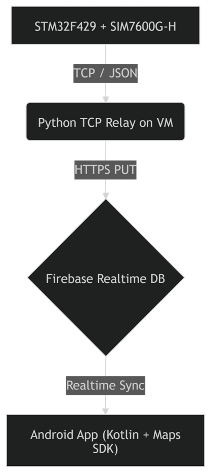

# CarTracker

**CarTracker** is an end‑to‑end, privacy‑preserving GPS vehicle tracking system built from scratch using embedded hardware, a lightweight cloud proxy, Firebase Realtime Database, and a Android application.
The system consists of:

- [**Embedded firmware**](firmware/stm32f429_sim7600_rawtcp) (STM32F429 + SIM7600G‑H) — obtains GNSS location and sends compact JSON via raw TCP/HTTP.
- [**Fly.io Python Proxy (Flask)**](server/python) — receives POST /update from the embedded device and pushes the data to Firebase Realtime Database.
- [**Firebase Realtime Database**] — stores the most recent location and enables real‑time sync.
- [**CarTracker Android app**](android) (Kotlin) — displays real‑time vehicle location from Firebase on Google Maps with geofencing behavior.

## System Architecture
<p align="center">
  
</p>

## Getting Started

### 1. Clone the repository
```bash
git clone https://github.com/ivan-marusic/CarTracker.git
```
---

## Features

- **Live location** updates to Firebase Realtime Database
- **Lightweight modem stack**: SIM7600 AT‑sockets
    - NETOPEN, CIPOPEN, CIPSEND
    - Manual HTTP POST assembly with correct Content-Length
- **Minimal data usage** (~120 bytes per update)
- **Low‑latency proxy** hosted on Fly.io with auto‑sleep
- **Android client** with:
    - Google Maps
    - Geofencing (radius check)
- **Fully offline‑capable MCU** (no Linux, no PPP required)
- **Extensible** to historical tracks, alerts, and telemetry (speed, sats, battery)

## Hardware

- STM32F429 microcontroller board
- SIM7600G-H CAT4 4G (LTE) Shield
- SIM7600G‑H module requires antennas
    - MAIN (LTE antenna)
    - GNSS antenna
- Female to Female jumper wires (UART wiring between STM32 and SIM7600G-H)
- PmodUSBUART module for debugging
- USB-A to Mini USB cable (STM32F429)
- USB-A to Micro USB cable (SIM7600G-H and PmodUSBUART)
- Machine-to-Machine (M2M) SIM card
    -> Tested with **Onomondo** network operator

<p align="center">
  
  
</p>

## Software & Tools

- **STM32CubeIDE** – firmware development and flashing
- **PuTTY** – UART debugging and AT command testing
- **Android Studio** – building and running the Android app
- **Python3** – running the TCP relay server
- **Fly.io proxy** – forwards JSON to Firebase
- **Firebase Console** – monitoring Realtime Database

## Firmware (STM32F429 + SIM7600G‑H)
The firmware communicates with the SIM7600G‑H modem via UART and performs:

- GNSS activation (`AT+CGNSPWR=1`)
- GNSS location retrieval (`AT+CGNSINF`)
- APN configuration (`AT+CGDCONT`)
- Modem IP stack activation (`AT+NETOPEN`)
- TCP socket creation (`AT+CIPOPEN`)
- JSON telemetry upload (`AT+CIPSEND`)

Telemetry JSON Format
```
{  
  "latitude": 44.110000,
  "longitude": 15.400000,
  "timestamp": "2025-08-09T16:30:00Z"
}
```
This structure matches the Firebase Realtime Database schema used by the Android app.
Full details, including setup and code structure, are located in: [firmware/stm32f429_sim7600_rawtcp](firmware/stm32f429_sim7600_rawtcp/)

## CarTracker Android app (Kotlin)
The Android app uses Firebase Realtime Database and Google Maps SDK to:
- Connects to Firebase Realtime Database
- Observes the /location node for live updates
- Displays the vehicle position on a map
- Shows whether the vehicle is inside/outside a configured radius
- Includes UI screens shown in [/images/](images)
<p align="center">
  
   
  
</p>

To run:

1. Open in Android Studio
2. Add Firebase configuration
3. Build and deploy. [See here](android)

## Testing the System

1.Start the Python TCP relay on the VM
(ensure the TCP port is open)
2. Power on the embedded device
3. Watch serial logs for:
    NETOPEN OK
    CIPOPEN OK
    SEND OK

4. Check Firebase Console -> Realtime Database -> /location

5. Open the Android app:
   -> Map updates live with the transmitted coordinates

## License
This project is MIT licensed unless stated otherwise in sub‑folders.
