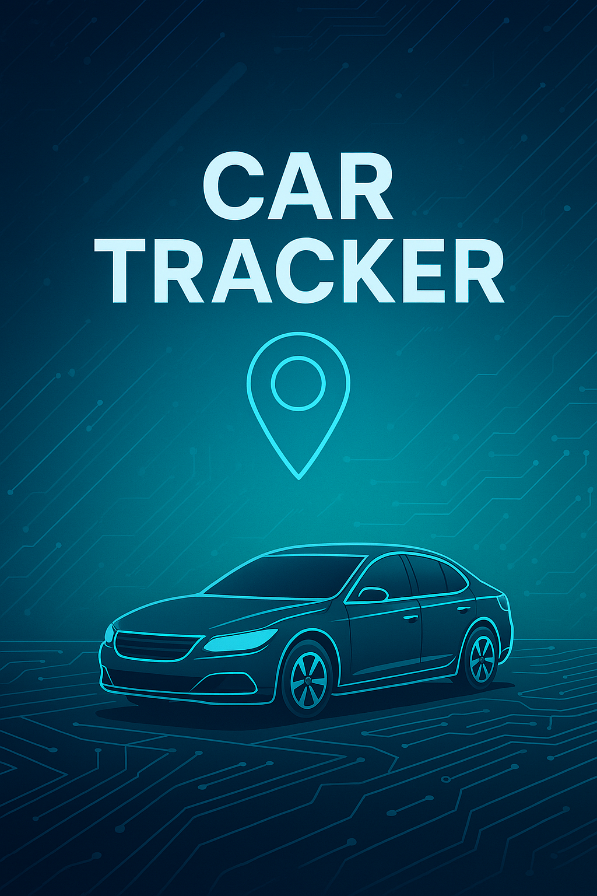
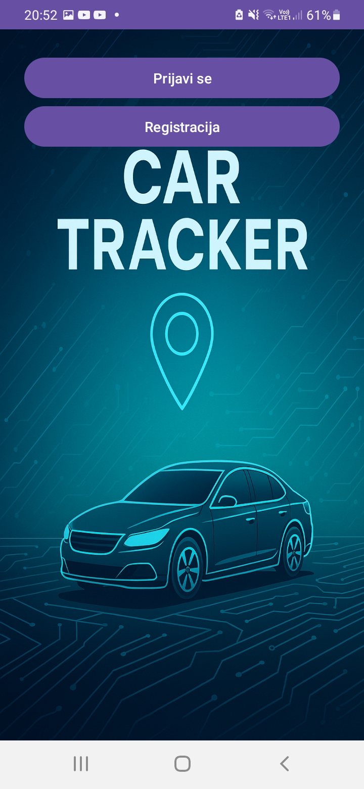
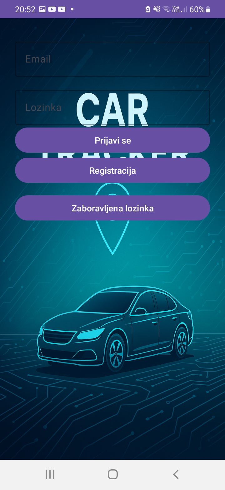
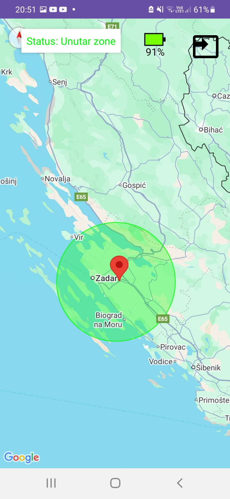
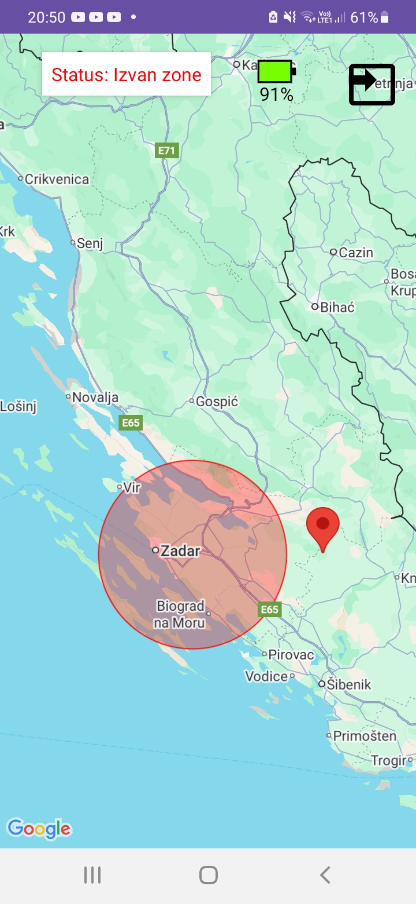

# CarTracker App

CarTracker App is an Android application that displays the real-time location of a vehicle using Firebase Realtime Database as the data source. 
The vehicle location is produced by an STM32F429 + SIM7600G‑H device, sent via a Fly.io Python proxy, and written to the /location node in Firebase.

<p align="center">
    
</p>

## Features

- Real-time location tracking (Firebase → Google Maps)
- Alerts when vehicle moves 30 km within a defined radius
- Location updates typically every 10 seconds (MCU configurable)
- Data is received instantly via Firebase realtime listeners

<div align="center">

<table>
  <tr>
    <td align="center"><strong>Start page</strong><br></td>
    <td align="center"><strong>Sign-up page</strong><br></td>
  </tr>
  <tr>
    <td align="center"><strong>Car in 30km radius</strong><br></td>
    <td align="center"><strong>Car out of radius</strong><br></td>
  </tr>
</table>

</div>

## Technologies Used

- Kotlin / Android SDK
- Google Maps SDK
- Firebase Realtime Database
- Fly.io Cloud Proxy (Flask + Gunicorn) →  writes telemetry to Firebase via Firebase Admin SDK
- Embedded device: STM32F429 + SIM7600G‑H GNSS (AT+CGPSINFO)

## Incoming Telemetry Format
The Android app listens to the /location node:
```JSON
{
  "latitude": 44.110000,
  "longitude": 15.400000,
  "timestamp": "2025-08-09T16:30:00Z"
}
```
This JSON is written by the Fly.io proxy after receiving telemetry from the MCU.

## Getting Started

1. Clone the repo:
   ```bash
   git clone https://github.com/ivan-marusic/CarTracker.git
   ```
2. Open the project in Android Studio
3. Configure Firebase in the `google-services.json`
4. Run the app on your device or emulator

## License

This project is licensed under the MIT License.
