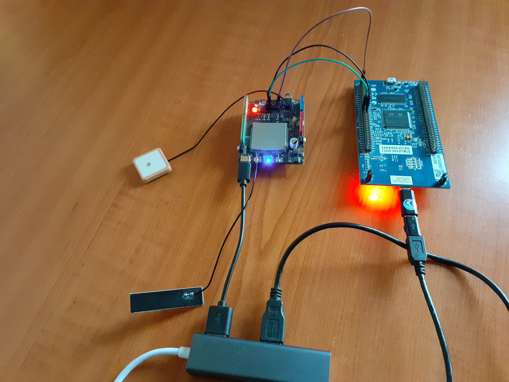
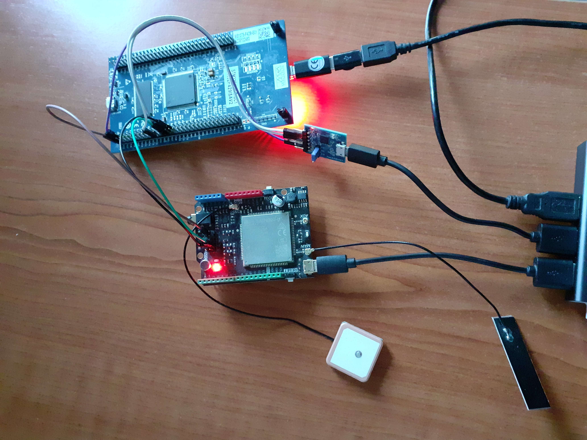

# Embedded Device (STM32F429 + SIM7600G-H CAT4 4G (LTE) Shield)

<p align="center">

</p>

STM32F429 + SIM7600G‑H Raw TCP Telemetry Firmware
This firmware is part of the CarTracker system, a vehicle‑tracking solution that sends real‑time GPS coordinates from a STM32F429 + SIM7600G‑H to a cloud proxy (Fly.io), which then forwards the data to Firebase Realtime Database. The Firebase data is consumed by the Android CarTracker app for live vehicle tracking

## Overview
This firmware runs on:

STM32F429 microcontroller
SIM7600G‑H 4G/LTE modem (UART communication)
GNSS receiver built into the SIM7600 module

Communication uses the SIM7600 internal TCP/IP stack.
The STM32 opens a raw TCP socket, manually sends an HTTP POST request, and closes/reuses the socket as needed.

The modem sends:

```JSON
{
"latitude": 49.110000, 
"longitude": 17.400000,
"timestamp": "2025-08-09T16:30:00Z"
}
```

Each packet is a newline‑terminated JSON string.

## Features

- Reads GNSS data using AT+CGPS=1 + AT+CGPSINFO
    - Formats timestamps into ISO‑8601 (YYYY-MM-DDTHH:MM:SSZ)
    - Connects to the cellular network using APN (e.g., "Onomondo" or your provider)
- Cellular IP stack:
    - AT+CGDCONT (APN)
    - AT+NETOPEN
    - AT+CSOCKSETPN=1
    - AT+CIPOPEN / AT+CIPSEND / AT+CIPCLOSE
- Manual HTTP POST over raw TCP
- Auto‑reconnect if the TCP link drops
- Tiny payload (~120 bytes / update)

## Repository Structure
<pre style="pointer-events: none;">
firmware/
│
├─ Core/
│  ├─ Inc/
│  │   ├─ sim7600.h          # SIM7600 AT/TCP driver interface
│  │   ├─ debug.h            # Logging macros (UART5)
│  │   └─ main.h             # CubeMX-generated
│  │
│  └─ Src/
│      ├─ sim7600.c          # SIM7600 driver (TCP + CGPSINFO GNSS parsing)
│      ├─ main.c             # Application loop (CGPSINFO → HTTP POST → Fly.io)
│      ├─ usart.c            # UART2 / UART5 init (CubeMX)
│      ├─ gpio.c             # GPIO init (CubeMX)
│      └─ stm32f4xx_it.c     # Interrupt handlers (CubeMX)
│
├─ Drivers/
│  └─ STM32F4xx_HAL_Driver/  # CubeMX HAL drivers
│
├─ images/
│  ├─ STM32F429+SIM7600G-H.jpg
│  └─ STM32F429+SIM7600G-H+PmodUSBUART.jpg
│
├─ Project.ioc               # CubeMX project configuration
└─ README.md                 # This firmware documentation
</pre>

## How It Works
1. Power on and initialize modem IP stack
```bash    
AT
ATE0
AT+CFUN=1
AT+CGATT=1
AT+CGDCONT=1,"IP","<APN>"     // e.g. "onomondo" or your provider
AT+CSOCKSETPN=1               // map sockets to PDP 1
AT+NETOPEN                    // expect +NETOPEN: 0
```

2. Enable GNSS (CGPS path) and read a fix
```bash
AT+CGPS=1                     // power on GNSS
AT+CGPSINFO                   // +CGPSINFO: <lat>,<N/S>,<lon>,<E/W>,<date>,<time>,...
```
Example
+CGPSINFO: 4458.5959,N,01523.4836,E,090825,163000.0, ...
Convert DDMM.MMMM → decimal degrees
Apply N/S/E/W sign
Convert DDMMYY + HHMMSS.s → ISO‑8601 UTC (YYYY‑MM‑DDTHH:MM:SSZ)

3. Open raw TCP → send manual HTTP POST to Fly.io
AT+CIPOPEN=0,"TCP","<VM-IP>",4000
```bash
AT+CIPOPEN=0,"TCP","cartracker-proxy.fly.dev",80
AT+CIPSEND=0,<len>
POST /update HTTP/1.1
Host: cartracker-proxy.fly.dev
Content-Type: application/json
Connection: close
Content-Length: <len>

{"latitude":..., "longitude":..., "timestamp":"..."}
```
The proxy performs an authenticated Admin SDK write → Firebase.
The Android app receives realtime updates from Firebase.

## Requirements

- STM32CubeIDE
- SIM7600G‑H module
- Valid APN for your M2M SIM card (e.g., "Onomondo")
- Fly.io Python Proxy deployed (Flask + Gunicorn)
- Firebase Realtime Database project
- Pmod USB‑UART(for debugging)
- Putty(for debugging)

## Debugging Setup (Pmod USB‑UART Sniffer)

During development, I used a **Pmod USB‑UART adapter** connected to **UART5** on the STM32F429 in order to monitor all communication between the MCU (UART2) and the SIM7600G‑H modem.

Although the SIM7600G‑H is wired to **USART2** (PD5 = TX2, PD6 = RX2), I routed the transmitted AT commands and received modem responses into **USART5** so they could be viewed on a PC terminal (Putty) at **115200 baud**.

This allows real‑time debugging of:
- All outgoing AT commands from STM32 → SIM7600  
- All incoming responses from SIM7600 → STM32  
- Errors such as `SEND FAIL`, `NETOPEN ERROR`, or malformed responses  

### **STM32 → Pmod USB‑UART wiring**

| STM32 Pin     | Function                   | Pmod USB‑UART |
|---------------|----------------------------|---------------|
| **PD2**       | UART5_RX  (receive log)    | TX            |
| **PC12**      | UART5_TX  (send debug)     | RX            |
| **GND**       | Ground                     | GND           |
| **Baudrate**  | 115200 8N1                 | —             |

### Monitoring USART2 via USART5

Even though **USART2** is the actual interface to the SIM7600G‑H module:

- **USART2_TX (PD5)** sends AT commands → modem  
- **USART2_RX (PD6)** receives responses ← modem  

I mirrored important log messages and raw AT traffic to **USART5**, so I could observe everything using the Pmod USB‑UART and a serial program such as PuTTY or Minicom.

This “debug UART tapping” is extremely helpful for:
- Debugging new AT commands  
- Watching GNSS output changes  
- Inspecting TCP socket sequences (`NETOPEN`, `CIPOPEN`, `CIPSEND`)  
- Diagnosing connectivity failures  

### Debugging Adapter
<p align="center">

</p>

## License

This firmware is part of the CarTracker project (MIT License applies to entire repository unless stated otherwise).
