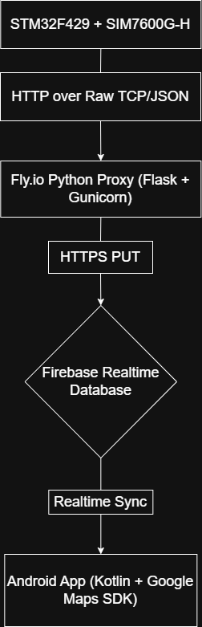

# Fly.io Proxy (Flask + Gunicorn) — CarTracker Cloud Bridge
This module is the lightweight Python HTTP proxy used in the CarTracker system.
Its job is to receive GPS JSON payloads from the STM32F429 + SIM7600G‑H embedded device and forward them to the Firebase Realtime Database using HTTPS.
The proxy runs on Fly.io Machines, supports auto‑start/auto‑sleep, and is optimized for low‑latency and minimal cost.

**Proxy exists because SIM7600 has many issues with HTTPS**:
- incompatible TLS versions
- certificate validation problems
- poor HTTP stack implementation
**The proxy solves this by**:
- accepting simple JSON from the modem
- performing a proper HTTPS PUT to Firebase

## Purpose
The MCU sends a simple JSON payload to this proxy, and the proxy handles the secure HTTPS PUT to Firebase. This module acts as the cloud bridge.

## Security Considerations
The Fly.io proxy encrypts all traffic between Fly.io → Firebase using HTTPS.
However, the connection between the SIM7600 modem and the Fly.io proxy is not encrypted when using plain HTTP.
The SIM7600G‑H module technically supports HTTPS, but it requires a modern TLS stack and valid CA certificates to be uploaded directly to the modem. My device is running an older firmware that does not fully support the necessary TLS features.

## System Architecture
<p align="center">
  
</p
## Deployment on Fly.io
Using this commands on Linux terminal:

1. Install Fly CLI
   ```bash
   curl -L https://fly.io/install.sh | sh
   ```
2. Log in
   ```bash
   fly auth login
   ```
3. Deploy the application
   From inside server/python/:
   ```bash
   fly launch
   fly deploy
   ```
4. Set your Firebase Realtime Database URL
   ```bash
   fly secrets set FIREBASE_URL="https://<your-db>.firebasedatabase.app/location.json"
   ```
This sets the correct Firebase endpoint for PUT requests.

## Testing the Proxy
1. Local test
```bash
FIREBASE_URL="https://your.firebaseio.com/location.json" python3 app.py
```
Send a test POST:
```bash
curl -X POST http://localhost:8080/update \
  -H "Content-Type: application/json" \
  -d '{"latitude":45.0,"longitude":17.0,"timestamp":"2025-08-09T16:30:00Z"}'
```
2. Test the live Fly.io deployment
```bash
curl -X POST https://cartracker-proxy.fly.dev/update \
  -H "Content-Type: application/json" \
  -d '{"latitude":45.0,"longitude":17.0,"timestamp":"2025-08-09T16:30:00Z"}'
```
Firebase should instantly update /location.


## License
MIT License (same as the entire CarTracker repository).
